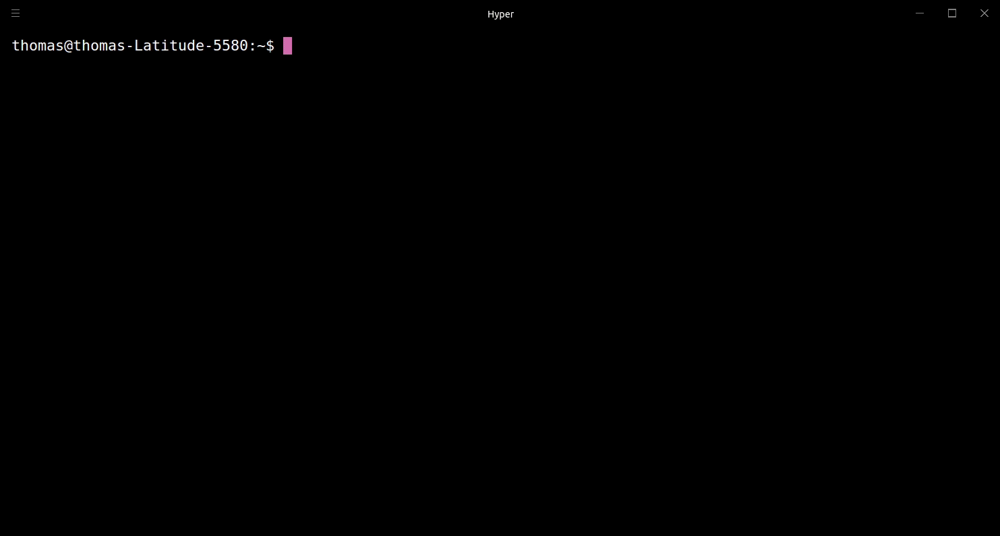

<h1 align="center">
    Charon
</h1>

<h4 align="center">
    Command line interface to create new workspaces based on templates
</h4>

## Description

Charon enables you to effectively create new workspaces based on predefined templates, by utilizing a simple and minimal usage syntax. Templates can be shared and managed accross teams through git. Templates are automaticly pulled and updated on all clients.

Visit the [contributing guidelines](https://github.com/perryrh0dan/charon/blob/master/contributing.md#translating-documentation) to learn more on how help developing charon.

Come over to [Twitter](https://twitter.com/perryrh0dan1) to share your thoughts on the project.

## Highlights
- Setup complex workspaces in seconds
- Templates support inheritence and placeholders
- Lightweight & fast
- Share templates across your team or community with git
- Configurable through `~/.charon.json`

## Contents

- [Description](#description)
- [Highlights](#highlights)
- [Contents](#contents)
- [Demo](#demo)
- [Install](#install)
- [Usage](#usage)
- [Configuration](#configuration)
- [Development](#development)
- [Team](#team)
- [License](#license)

## Demo

<div align="center">
  
</div>

## Install

Download the latest release from charon. 

## Usage

### Cli

``` bash
charon init example --template typescript --directory . --repository https://github.com/perryrh0dan/example 
```

### Templates

Templates can be configured with a `meta.json` in the root of the template. 

#### Format

``` json
{
    "name": "",
    "extend": [""],
    "exclude": [""],
}
```

#### Extend

Templates can extends other templates. Add the name of the templates you want to extend in the extend array in the `meta.json`. The extended templates are `copied` on by on in the `same direction` they are `added` in the `meta.json.

#### Exclude

List of filenames to exclude from the template.

#### Placeholders

Placeholders can be used in each file of your template. During the initlialization the placeholders are replaced by the actual values. At the moment following placeholders are supported:
- {{name}}
- {{repository}} 

## Configuration

To configure taskline navigate to the ~/.charon.json file and modify any of the options to match your own preference. To reset back to the default values, simply delete the config file from your home directory.

The following illustrates all the available options with their respective default values.

``` json
{
  "templates_dir": "$HOME/.charon/templates",
  "templates_repo": {
    "url": "https://github.com/perryrh0dan/templates",
    "auth": "none",
    "token": null,
    "username": null,
    "password": null
  }
}
```

### In Detail

#### templates_dir
- Type: String
- Default: $HOME/.charon/templates

Filesystem path where all the templates are stored.

#### templates_repo
- Type: String
- Default: $HOME/.charon/templates

##### url
- Type: String
- Default: $HOME/.charon/templates

Url of the repository where templates are managed.

##### auth
- Type: String
- Default: none
- Values: `none`, `token`

##### token
- Type: String
- Default: none

Access token is only used when auth type is token

##### username
- Type: String
- Default: none

Coming soon

##### password
- Type: String
- Default: none

##### privatekey

Coming soon

##### 

## Development

## Team

- Thomas Pöhlmann ((@perryrh0dan))[https://github.com/perryrh0dan]

## License

(MIT)[https://github.com/perryrh0dan/charon/blob/master/license.md]