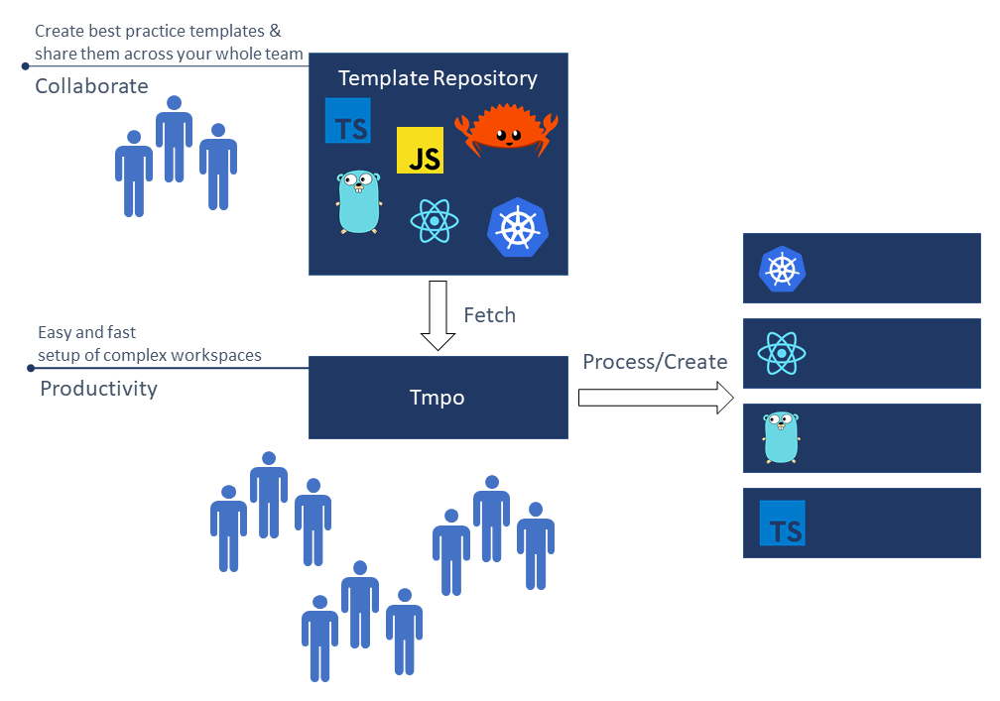
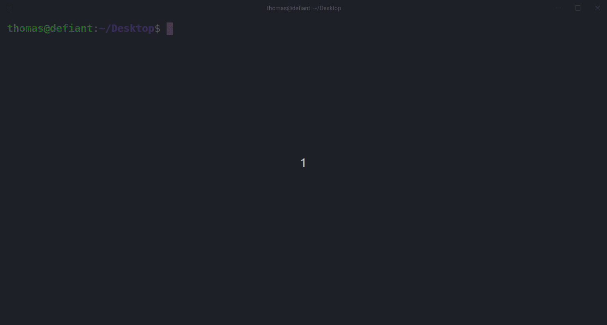

<h1 align="center">
    Tmpo
</h1>

<h4 align="center">
    Command line utility to quickly create new workspaces based on templates
</h4>

<div align="center">
  
</div>

<div align="center">
   <a href="https://travis-ci.com/perryrh0dan/tmpo">
      
   </a>
   <a href="https://codecov.io/gh/perryrh0dan/tmpo">
      
   </a>
   <a href="https://codeclimate.com/github/perryrh0dan/tmpo/maintainability">
      
   </a>
   <a href="https://gitter.im/perryrh0dantmpo/community">
      
   </a>
</div>

## Description

Tmpo enables you to effectively create new workspaces based on predefined templates. To share templates across your team tmpo is using a git repository to manage your templates. Templates are automaticly fetched and merged on all clients. 

<div align="center">
  
</div>

Visit the [contributing guidelines](https://github.com/perryrh0dan/tmpo/blob/master/contributing.md) to learn more on how help developing tmpo.

Come over to [Gitter](https://gitter.im/perryrh0dantmpo/community?source=orgpage) or [Twitter](https://twitter.com/perryrh0dan1) to share your thoughts on the project.

## Highlights
- Setup complex workspaces in seconds
- Templates support inheritence and placeholders
- Simple, Lightweight & fast
- Cross-platform: Linux, Windows and mac are official supported
- Everything can be a template. Python, Rust, Typescript, latex, markdown,... 
- Share templates across your team or community with git
- Configurable through `~/.tmpo/config.yaml`

## Contents

- [Description](#description)
- [Highlights](#highlights)
- [Contents](#contents)
- [Demo](#demo)
- [Install](#install)
- [Flight Manual](#flight-manual)
- [Configuration](#configuration)
- [Development](#development)
- [Team](#team)
- [License](#license)

## Demo

<div align="center">
  
</div>

## Install

1. Download the latest [release](https://github.com/perryrh0dan/tmpo/releases) for your platform.
2. Copy the binary to your `/bin` folder or point the path variable to it.

## Flight Manual

### Quick Start

1. Add a [repository](#repositories) or use the [default repository](https://github.com/perryrh0dan/templates)
``` bash
tmpo repository add
```

2. Setup your first project
``` bash
tmpo init
```

### CLI

``` 
tmpo 1.5.3
Thomas P. <thomaspoehlmann96@googlemail.com>
Cli to create new workspaces based on templates

USAGE:
    tmpo [SUBCOMMAND]

FLAGS:
    -h, --help       Prints help information
    -V, --version    Prints version information

SUBCOMMANDS:
    config        View configuration
    help          Prints this message or the help of the given subcommand(s)
    init          Initialize new workspace [aliases: i]
    repository    Maintain repositories
    template      Maintain templates
    update        Update to the latest release
```

### Repositories

A repository is a folder that contains up to n different templates. A repository can be connected with a remote git repository. Templates are then automaticly synced. Repositories are located in the 'template_dir'.

To add a new repository use the `repository subcommand` and follow the instructions on the screen.

``` bash
tmpo repository add
```

### Templates

Templates can be configured with a `meta.json` in the template root. 
For a detailed description how to create and maintain templates have a look at the instructions and the default template repository [repository](https://github.com/perryrh0dan/templates)

## Configuration
The configuration file should only be changed by experienced users.

To configure tmpo navigate to the ~/.tmpo/config.yaml file and modify any of the options to match your own preference. To reset back to the default values, simply delete the config file from your home directory.

The following illustrates all the available options with their respective default values.

``` yaml
  templates_dir: /home/thomas/.tmpo/templates
  templates_repositories:
    - name: default
      description: this is the default template repository from tpoe
      git_options:
        enabled: true
        provider: github
        url: "https://github.com/perryrh0dan/templates"
        branch: master
        auth: none
        token: 
        username: ~
        password: ~
```

## Development

### Build

#### Binary

Tmpo is using [cross](https://github.com/rust-embedded/cross) to build cross platform.

``` bash
cross build --target x86_64-pc-windows-gnu
cross build --release --target x86_64-pc-windows-gnu
```

### Benchmark

#### Flamegraph

- Follow [this](https://github.com/flamegraph-rs/flamegraph) steps to install flamegraph
- Run following command
``` bash
cargo flamegraph --dev --bin=tmpo init thomas
```

## Team

- Thomas Pöhlmann [(@perryrh0dan)](https://github.com/perryrh0dan)

## License

[MIT](https://github.com/perryrh0dan/tmpo/blob/master/license.md)
