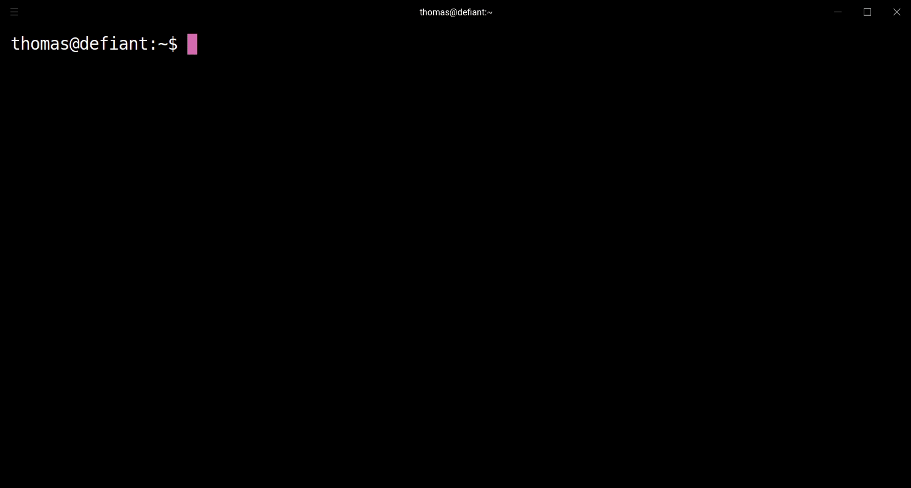

<h1 align="center">
    Charon
</h1>

<h4 align="center">
    Command line interface to create new workspaces based on templates
</h4>

<div align="center">
   <a href="https://travis-ci.com/perryrh0dan/charon">
      
   </a>
   <a href="https://codecov.io/gh/perryrh0dan/charon">
      
   </a>
   <a href="https://codeclimate.com/github/perryrh0dan/charon/maintainability">
      
   </a>
   <a href="https://gitter.im/perryrh0dan/charon/community">
      
   </a>
</div>

## Description

Charon enables you to effectively create new workspaces based on predefined templates. To share templates across your team charon is using a git repository to manage your templates. Templates are automaticly fetched and merged on all clients. 

Visit the [contributing guidelines](https://github.com/perryrh0dan/charon/blob/master/contributing.md) to learn more on how help developing charon.

Come over to [Twitter](https://twitter.com/perryrh0dan1) to share your thoughts on the project.

## Highlights
- Setup complex workspaces in seconds
- Templates support inheritence and placeholders
- Lightweight & fast
- Share templates across your team or community with git
- Configurable through `~/.charon/config.yaml`

## Contents

- [Description](#description)
- [Highlights](#highlights)
- [Contents](#contents)
- [Demo](#demo)
- [Install](#install)
- [Usage](#usage)
- [Configuration](#configuration)
- [Development](#development)
- [Team](#team)
- [License](#license)

## Demo

<div align="center">
  
</div>

## Install

1. Download the latest release for your platform.
2. Copy the binary to your `/bin` folder or point the path variable to it.

## Usage

### Cli

``` bash
charon init example --repository default --template typescript --directory .
```

### Repositories

A repository is a folder that contains up to n different templates. A repository can be connected with a remote git repository. Templates are then automaticly synced. Repositories are located in the 'template_dir'. 

### Templates

Templates can be configured with a `meta.json` in the template root. The official template repository can be found [here](https://github.com/perryrh0dan/templates).

#### Format

``` json
{
    "name": "",
    "extend": [""],
    "exclude": [""],
    "scripts": {
      "before_install": ""
    }
}
```

#### Extend

Templates can extend other templates. Add the name of the templates you want to extend in the extend array in the `meta.json`. The extended templates are `copied` on by on in the `same direction` they are `added` in the `meta.json.

#### Exclude

List of filenames to exclude from the template.

#### Placeholders

Placeholders can be used in each file of your template. During the initlialization the placeholders are replaced by the actual values. At the moment following placeholders are supported:
- {{name}}
- {{repository}} 
- {{username}} // fetched from global git config
- {{email}} // fetched from global git config

## Configuration

To configure charon navigate to the ~/.charon/config.yaml file and modify any of the options to match your own preference. To reset back to the default values, simply delete the config file from your home directory.

The following illustrates all the available options with their respective default values.

``` yaml
  templates_dir: /home/thomas/.charon/templates
  templates_repositories:
    - name: default
      description: this is the default template repository from tpoe
      git_options:
        enabled: true
        url: "https://github.com/perryrh0dan/templates"
        auth: none
        token: 
        username: ~
        password: ~
```

### In Detail

#### templates_dir
- Type: String
- Default: $HOME/.charon/templates

Filesystem path where all the templates are stored.

#### templates_repo
- Type: String
- Default: $HOME/.charon/templates

##### url
- Type: String
- Default: $HOME/.charon/templates

Url of the repository where templates are managed.

##### auth
- Type: String
- Default: none
- Values: `none`, `token`

##### token
- Type: String
- Default: none

Access token is only used when auth type is token

##### username
- Type: String
- Default: none

Coming soon

##### password
- Type: String
- Default: none

##### privatekey

Coming soon

##### 

## Development

### Build

#### Binary

Charon is using [cross](https://github.com/rust-embedded/cross) to build cross platform.

``` bash
cross build --target x86_64-pc-windows-gnu
cross build --release --target x86_64-pc-windows-gnu
```

#### Flatpak

tbd


## Team

- Thomas Pöhlmann [(@perryrh0dan)](https://github.com/perryrh0dan)

## License

[MIT](https://github.com/perryrh0dan/charon/blob/master/license.md)
